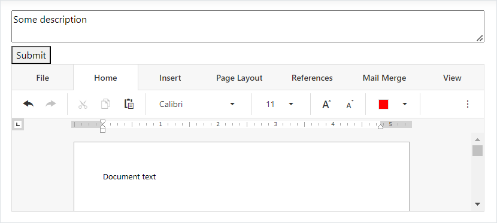

<!-- default badges list -->

<!-- default badges end -->
# Rich Text Editor for ASP.NET Core - How to submit document content with other form values

This example demonstrates how to submit the content of a document opened in the Rich Text Editor control with other form values.

Once a user clicks the **Submit** button, the example calls the control's [saveDocument](https://docs.devexpress.com/AspNetCore/js-DevExpress.RichEdit.RichEdit#js_devexpress_richedit_richedit_savedocument) method and invokes the [Saving](https://docs.devexpress.com/AspNetCore/DevExpress.AspNetCore.RichEdit.RichEditBuilder.OnSaving%28System.String%29) event. The event handler uses [base64](https://docs.devexpress.com/AspNetCore/js-DevExpress.RichEdit.SavingEventArgs#js_devexpress_richedit_savingeventargs_base64) and [format](https://docs.devexpress.com/AspNetCore/js-DevExpress.RichEdit.SavingEventArgs#js_devexpress_richedit_savingeventargs_format) event arguments to obtain the content and format of the document opened in the Rich Text Editor. The handler saves the document's content and format to hidden fields and submits the form.

## Files to Review

* [HomeController.cs](./CS/Controllers/HomeController.cs)
* [TestModel.cs](./CS/Models/TestModel.cs)
* [Index.cshtml](./CS/Views/Home/Index.cshtml)

## Documentation

* [Document Management in Rich Text Editor](https://docs.devexpress.com/AspNetCore/400972/rich-edit/document-management)

## More Examples

* [How to load/save documents from/to a database](https://github.com/DevExpress-Examples/asp-net-core-richedit-work-with-database)
